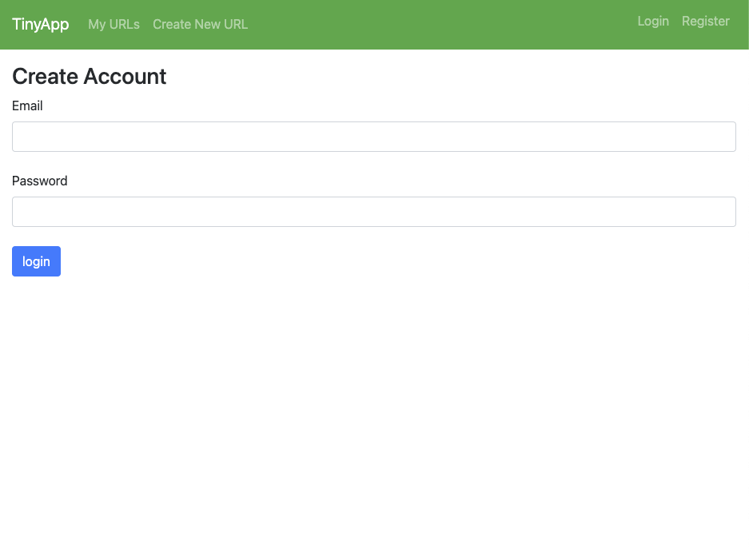

# TinyApp Project

TinyApp is a full-stack web application built with Node and Express that allows users to shorten long URLs (à la bit.ly).
The goal of this project is to build a multipage application that helps demonstrate: user authentication, logged-in states, and demonstrate the ability to perform CRUD operations on entries.

## Final Product

## Dependencies

- Node.js
- Express
- EJS
- bcryptjs
- cookie-session

## Getting Started

- Install all dependencies (using the `npm install` command).
- Run the development web server using the `node express_server.js` or  `npm start` commands.

### Note

- You will need to enter long urls in the `https //www.example.com format to work with this project.
